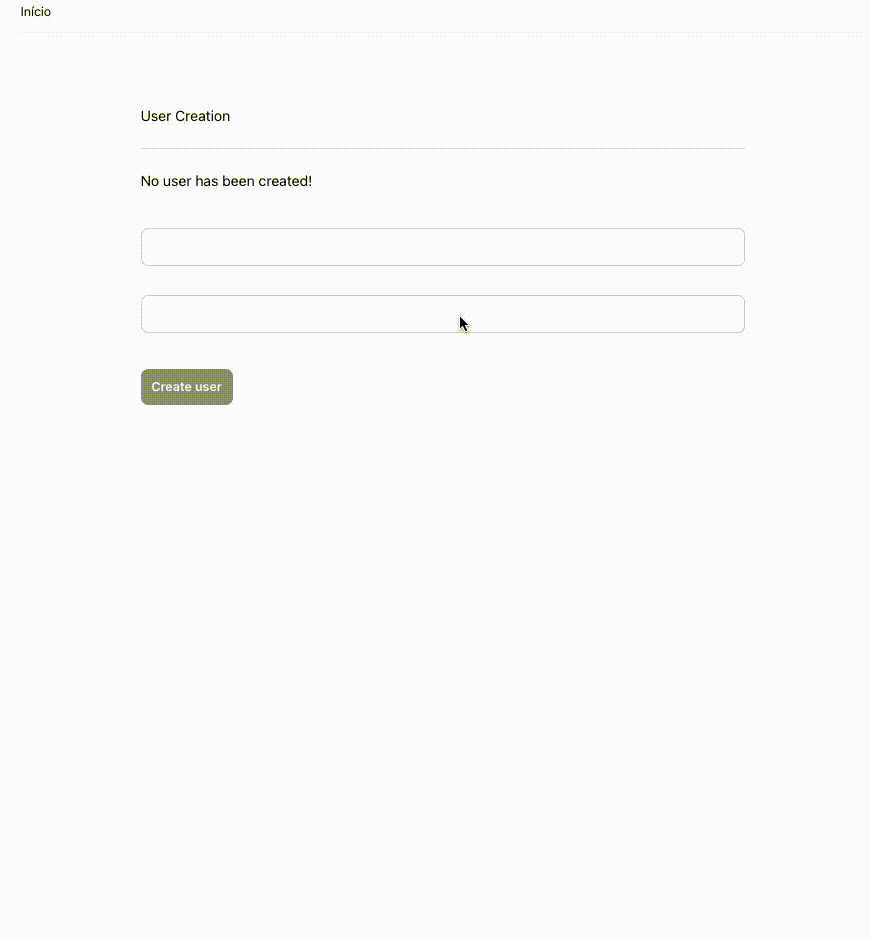

# Console

This is an exercise to work out how the new `Phoenix.HTML.Form.to_form/1` function works and how one can use changesets to make current Phoenix 1.7 forms.

To start this single-shot tryout server:

* Run `mix deps.get && mix deps.compile` to install and setup dependencies.
* Start Phoenix endpoint with `mix phx.server` and visit [`localhost:4000`](http://localhost:4000) on your browser.
* Example below:  
  

